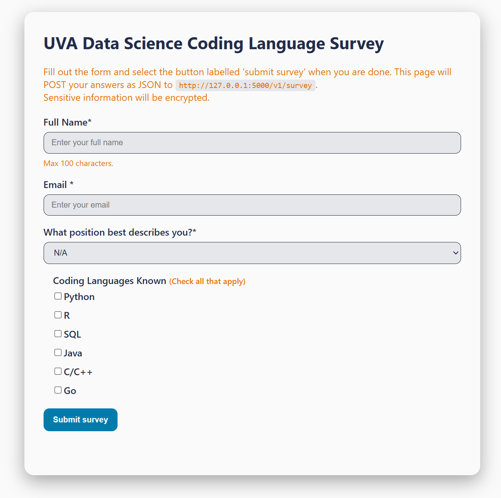
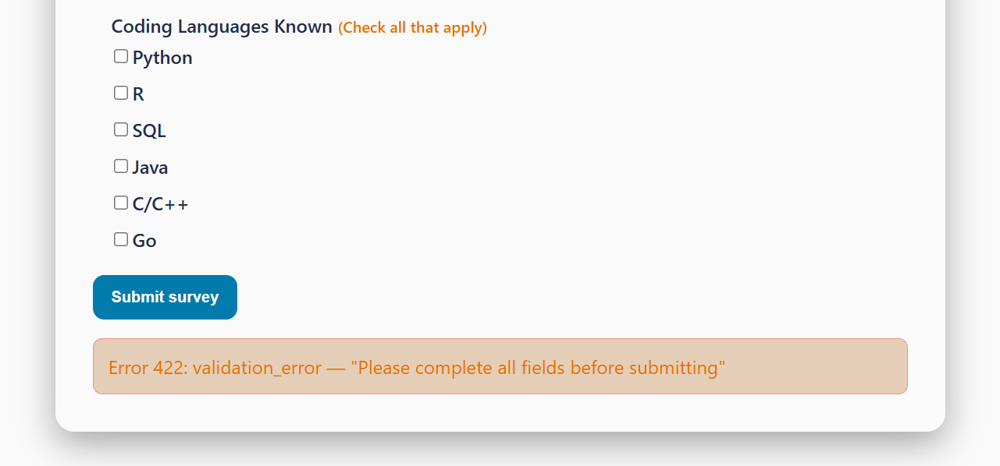
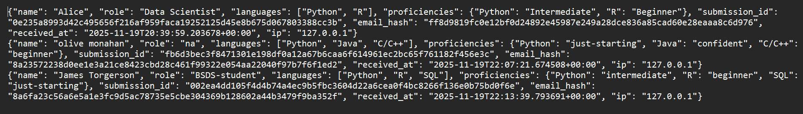
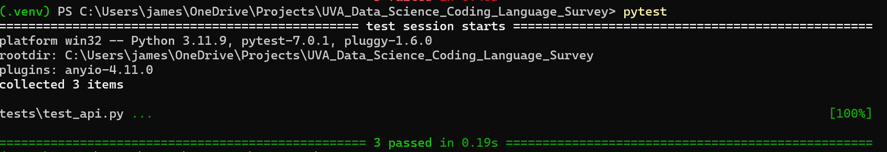

# SDS Coding Language Survey (for DS 2022 Final Case Study)

## Executive Summary

### Problem / Motivation
Imagine you are an administrator a UVA's School ofData Science. You want to gather information about what the most popular coding languages are amongst students and staff at the School of Data Science, so you can make informed decisions about what languages to focus on in the curriculum and what languages to offer support for in labs and workshops. To do this, you want to create an application that allows for users to submit their known coding languages via webform and a way to store that data for later analysis.

### Solution
This project creates 1) an HTML form for users to submit data and 2) a Flask API backend to handle data submission and storage. The HTML form collects data about the user's name, email, position in the School of Data Science (BSDS, MSDS, PhD, Faculty, N/A), known coding languages (Python, R, SQL, Java, C/C++, and Go), and their proficiency with those languages (Just Starting Out, Beginning, Intermediate, Confident). The Flask API has endpoints to serve this HTML page, perform a health check, and to POST submitted survey data. This data is stored as a .ndjson file. This project is containerized using Docker for easier deployment, and it is served as a public web page using Azure App Services.

## System Overview

### Course Concept(s)
This project primarily draws on concepts from Case 4. Specifically, it draws upon Flask API development, Pydantic integration for data validation, JSON handling, HTTP status codes, and integration of HTML frontends with a Flask backend. Additionally, it draws on Azure App Services deployment concepts from Case 5 to deploy the app to a public cloud environment, and Docker concepts from Case 9 to containerize the application. 

### Architecture Diagram   
```
UVA_Data_Science_Coding_Language_Survey/
├─ app.py                # Flask API application (POST /v1/survey)
├─ models.py             # Pydantic v1 schemas (validation)
├─ storage.py            # Append-only JSON Lines helper
├─ requirements.txt
├─ Dockerfile
├─ frontend/
│  ├─ index.html         # Survey form
├─ data /                # will contain survey.ndjson after submissions
└─ tests/
   ├─ conftest.py        # Pytest configuration
   ├─ test_api.py        # Pytest tests for Flask API 
```

Here's a screenshot of how the file looks the computer context:


### Data/Models/Services
Beyond the exact technologies used, this project was made possible by documentation of and tutorials for key Flask API and HTML concepts. Here are the links to those sources:   
- [Testing Flask Applications (With Pytest)](https://flask.palletsprojects.com/en/stable/testing/)
- [Pytest Configuration Documentation](https://docs.pytest.org/en/stable/reference/customize.html)
- [W3Schools HTML Forms Tutorial](https://www.w3schools.com/html/html_forms.asp)

Since this was also based on case study 4 from this course, it draws on the code used in that case study for HTML and Flask API development. The original code for that case study can be found [here](https://github.com/researcher111/case-04/tree/main).    

## How to Run (Local)
Using Docker, run the following command from the root directory of this repository:

```
# build 

docker build -t sds-coding-language-survey-app . 

#run 

docker run -d -p 5000:5000 --name survey-api sds-coding-language-survey-app 

# health check 

curl http://127.0.0.1:5000/health 
```   

To run tests, activate a Python virtual environment and run the `pytest` command from the root directory of the repository.   

## Design Decisions

### Why this Concept?  
At first, I was considering a project more based on Case 7 that integrated Azure Blob Storage for creating a database of survey data and creating real-time visualizations of that data. However, this project would be much more complex and time-consuming, and I wanted to focus on creating a smaller, more comprehensible project, given my limited experience in the development end of web applications (in addition to anxieties about costs of Azure services). So, I scaled down my project to resemble Case 4 and focus on simple webform data collection and how to connect that to a Flask API backend.   

### Trade-offs
Because I ended up going with a simpler concept, there is less that this project is able to do. It only serves an .ndjson file, so any additional analysis will need to be done outside of the project.   
This project also originally had a separate CSS file for HTML styling, but I was running into issues with Flask serving static files from Docker. So I inlined the CSS into the `<style>` of the HTML file to simplify things.   

### Security/Privacy
In the app.py file, incoming data is validated using Pydantic models to ensure that only expected data types and values are accepted. Additionally, since this is a simple survey application, no particularly sensitive personal information is collected beyond name and email. But, in storage, while the name is kept intact for identifying the responses, the email is hashed using SHA-256 before being stored.   

### Ops  
This app does not serve logs/metrics beyond what can be seen in the console when running the app. For scaling, if this project were to be scaled up, a more robust database would be needed to store the data beyond a single .ndjson file and the hosting service would need to be able to handle greater amounts of traffic.   

## Results and Evaluation   
**Frontend**   
   

**Form Error Response**   
   

**Data Storage**   
   

**Passing Smoke Tests**   
   


## What's Next
Because this is a simple survey application that only works on the data collection side, there are a few possible ways to improve or extend this project.  

First, the application and associated HTML form could be enhanced with more data fields, such as allowing users to add more demographic information (eg. age, educational background) or options for coding languages not already listed in the form. Depending on what the client/user wants to see using the data, this could show additional factors in what coding languages are more popular amongst different groups of people.    

Second, the application could be extended to show summaries of the data, including data visualization features. This would be done by adding additional API endpoints to show the aggregate data, maybe including visualizations to enhance understanding. This could also be expressed on the frontend by creating a dashboard accessible via the HTML pages of the webapp. 

Lastly, the application could be extended to include user authentication, which is the standard practice for most in-house university surveys. However, this would probably require a much more complex backend system and, if wanting to keep consistent with the university's authentication system, would require integration with Netbadge (which is well beyond the scope of this project!).   

## Links
GitHub Repository: <https://github.com/james-torgerson/Final-Case-DS-2022-Coding-Language-Survey>   

Public Cloud App: <http://sds-coding-language-survey-app.azurewebsites.net>   
